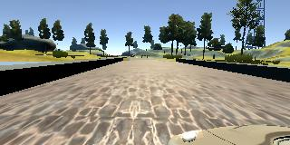
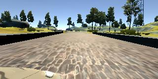

# **Behavioral Cloning** 

[//]: # (Image References)

[image1]: ./writeup_images/center_2016_12_01_13_30_48_404.jpg "Center Image"
[image2]: ./writeup_images/left_2016_12_01_13_30_48_404.jpg "Left Image"
[image3]: ./writeup_images/right_2016_12_01_13_30_48_404.jpg "Right Image"
[image4]: ./writeup_images/flip_2016_12_01_13_30_48_404.jpg "Flip Image"

### Files Submitted & Code Quality

#### 1. Submission includes all required files and can be used to run the simulator in autonomous mode

My project includes the following files:
* model.py containing the script to create and train the model
* drive.py for driving the car in autonomous mode
* model.h5 containing a trained convolution neural network 
* writeup.md 

#### 2. Submission includes functional code
Using the Udacity provided simulator and my drive.py file, the car can be driven autonomously around the track by executing 
```sh
python drive.py model.h5
```

#### 3. Submission code is usable and readable

The model.py file contains the code for training and saving the convolution neural network. The file shows the pipeline I used for training and validating the model, and it contains comments to explain how the code works.

### Model Architecture and Training Strategy

#### 1. An appropriate model architecture has been employed

My model consists of a convolution neural network with 5x5 filter sizes and depths between 24 and 48, moreover a convolution neural network with 3x3 filter sizes and depths between 48 and 64.

The model includes RELU layers to introduce nonlinearity, and the data is normalized in the model using a Keras lambda layer. 

#### 2. Attempts to reduce overfitting in the model

The model was trained and validated on different data sets to ensure that the model was not overfitting. The model was tested by running it through the simulator and ensuring that the vehicle could stay on the track.

#### 3. Model parameter tuning

The model used an adam optimizer, so the learning rate was not tuned manually.

#### 4. Appropriate training data

Training data was chosen to keep the vehicle driving on the road. I used a combination of center lane driving, recovering from the left and right sides of the road.

For details about how I created the training data, see the next section. 

### Model Architecture and Training Strategy

#### 1. Solution Design Approach

For data processing, put on Lambda layer to normalize images and I can see lower traning loss and validation loss.

Import keras, design as lenet(cnn) because lenet work with a wide range of input image sizes.

In order to gauge how well the model was working, I split my image and steering angle data into a training and validation set. I found that my first model had a low mean squared error on the training set but a high mean squared error on the validation set. This implied that the model was overfitting. 

Also, I did data augmentation for helping the model generalize better so I just flip the images horizontally. The data augmentation has two meaning that are increasing dataset and creating comprehensive dataset.

Finally, I NVIDIA architecture for updating the model. At the end of the process, the vehicle is able to drive autonomously around the track without leaving the road.

#### 2. Final Model Architecture

The final model architecture consisted of a convolution neural network with the following layers.

| Layer | Description |
| :---: | :---: |
| Input | 160x320x3 RGB images |
| Cropping | top 75, bottom 25 |
| Convolution 5x5 | 2x2 stride, 24 filters |
| RELU | for activation |
| Convolution 5x5 | 2x2 stride, 36 filters |
| RELU | for activation |
| Convolution 5x5 | 2x2 stride, 48 filters |
| RELU | for activation |
| Convolution 3x3 | 1x1 stride, 64 filters |
| RELU | for activation |
| Convolution 3x3 | 1x1 stride, 64 filters |
| RELU | for activation |
| Flatten | Outputs 100 |
| Flatten | Outputs 50 |
| Flatten | Outputs 10 |
| Flatten | Outputs 1 |

* Convolution kernel is equal to filter
* Subsample is equal to stride

#### 3. Creation of the Training Set & Training Process

To capture good driving behavior, I first recorded two laps on track one using center lane driving. Here is an example image of center lane driving:

![alt text][image1]

I then recorded the vehicle recovering from the left side and right sides of the road back to center so that the vehicle would learn to steer to the left and right. 

  

Then I repeated this process on track two in order to get more data points.

To augment the data sat, I also flipped images and angles thinking that this would increase image data for training a model. For example, here is an image that has then been flipped:

![alt text][image1]
![alt text][image4]

I finally randomly shuffled the data set and put Y% of the data into a validation set. 

I used this training data for training the model. The validation set helped determine if the model was over or under fitting. The ideal number of epochs was 5. I used an adam optimizer so that manually training the learning rate wasn't necessary.

## Others
* I had a problem with ffmpeg installed by brew at my local pc(MacBook Pro)
```sh
# This will be caused error
brew install ffmpeg

# In my case, this command clean errors up
brew install --use-clang --HEAD ffmpeg --with-faac --with-fdk-aac --with-ffplay --with-fontconfig --with-freetype --with-frei0r --with-libass --with-libbluray --with-libcaca --with-libquvi --with-libsoxr --with-libvidstab --with-libvorbis --with-libvpx --with-opencore-amr --with-openjpeg --with-openssl --with-opus --with-rtmpdump --with-speex --with-theora --with-tools --with-x265 --enable-libx264 --enable-gpl --enable-libxvid --enable-shared
```
* I will check [this airticle](https://arxiv.org/abs/1708.03798).
